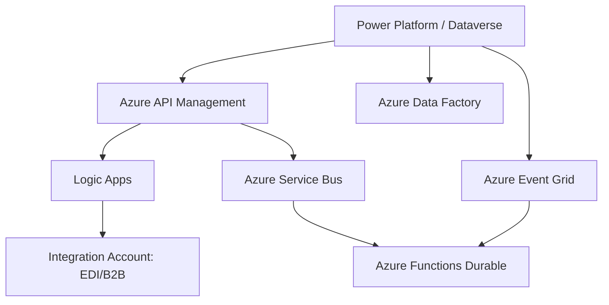
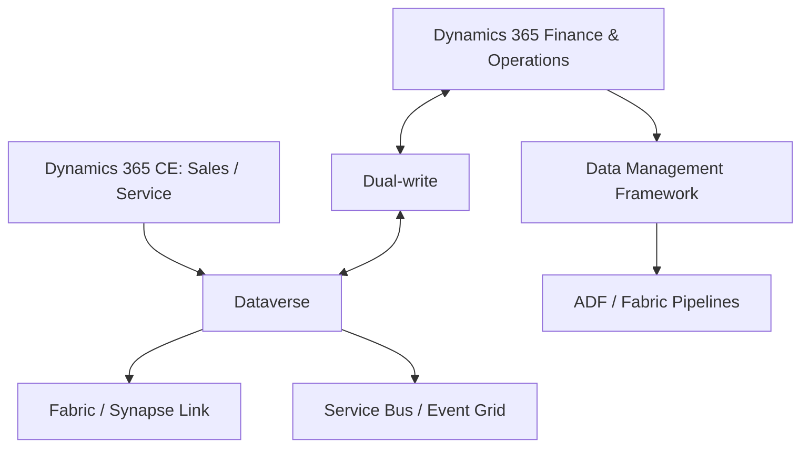

### 🎯 Objetivo
Diseñar e implementar arquitecturas de integración enterprise usando el stack completo de Azure Integration Services: Logic Apps, API Management, Service Bus, Event Grid, Azure Functions y Azure Data Factory, orquestados para crear sistemas de integración robustos con Power Platform en el centro.

### 📖 Conceptos Clave
- **Azure Logic Apps:** servicio de orquestación de integraciones enterprise hospedado en Azure, análogo a Power Automate pero diseñado para escenarios IT con requisitos de SLA estrictos, transformaciones complejas y protocolos B2B (EDI, AS2, HL7). Existen dos planes: Consumption (pago por ejecución, multi-tenant) y Standard (plan dedicado, puede correr en contenedores). Logic Apps Standard soporta desarrollo local con VS Code y despliegue via Azure DevOps. Ejemplo de uso: integración con SAP usando el conector SAP nativo de Logic Apps que habla BAPI/RFC directamente sin middleware adicional.
- **Azure API Management (APIM):** gateway de APIs con funciones de portal de desarrolladores, versioning semántico (v1, v2), rate limiting, analytics, y transformación de políticas en XML (inbound/backend/outbound/on-error). Actúa como el único punto de entrada para todas las APIs de la organización, ocultando la complejidad de los backends. APIM puede exponer APIs de Dataverse, Logic Apps, Azure Functions y servicios externos bajo un dominio único (api.empresa.com). Los "Productos" en APIM agrupan APIs y definen los términos de acceso para distintos grupos de consumidores.
- **Azure Service Bus:** servicio de mensajería empresarial PaaS para desacoplar productores de consumidores en integraciones asíncronas. Soporta Queues (un consumidor por mensaje), Topics con Subscriptions (múltiples consumidores reciben cada mensaje), Sessions (procesamiento ordenado de mensajes relacionados por una clave de sesión), y Dead Letter Queue (DLQ) para mensajes no procesables. Garantiza entrega at-least-once con duplicado detection. El nivel Premium soporta inyección en VNET y aislamiento de red; obligatorio para integraciones con datos sensibles.
- **Azure Event Grid:** servicio de enrutamiento de eventos cloud-native con modelo pub/sub que distribuye eventos desde fuentes de Azure (Dataverse, Blob Storage, IoT Hub) a múltiples suscriptores (Azure Functions, Logic Apps, Service Bus, WebHooks) con latencia de milisegundos. Soporta filtrado de eventos por tipo y atributos, reintentos con backoff exponencial, y dead-lettering. Dataverse puede publicar eventos de creación, actualización y eliminación de registros a Event Grid, habilitando arquitecturas EDA (Event-Driven Architecture) en Power Platform.
- **Azure Data Factory (ADF):** servicio ETL/ELT de Azure para orquestación de pipelines de datos a gran escala con más de 90 conectores nativos (SAP, Oracle, Salesforce, databases). Útil para cargas batch de alto volumen y migraciones de datos históricos. Para proyectos nuevos, evaluar Microsoft Fabric Pipelines como alternativa moderna con interfaz unificada; ADF sigue siendo relevante en entornos enterprise con inversión existente. ADF tiene un concepto de Integration Runtime que permite ejecutar actividades en redes privadas (Self-hosted IR) o en ambientes de nube (Azure IR).
- **Azure Functions Durable:** extensión de Azure Functions que habilita orquestaciones stateful de larga duración con patrones como Fan-out/Fan-in (paralelizar trabajo y consolidar resultados), Function Chaining (secuencia de pasos), Human Interaction (esperar aprobación humana hasta X días), y Monitor (polling hasta que se cumpla una condición). El estado de la orquestación se persiste en Azure Storage, lo que permite suspender y reanudar sin perder contexto. Ideal para procesos batch complejos que duran horas o días.
- **Integration Account:** recurso de Azure vinculable a Logic Apps que actúa como repositorio de artefactos B2B: schemas XML (para validar mensajes), mapas XSLT (para transformar formatos), certificados, socios de negocio (partners) y acuerdos EDI (AS2, X12, EDIFACT). Obligatorio para integraciones con industrias como retail (EDI X12 850/856/810), salud (HL7 FHIR), o finanzas que requieren intercambio electrónico de documentos estructurados.
- **APIM Developer Portal:** portal web auto-hospedado incluido en Azure API Management donde los desarrolladores internos y externos pueden descubrir APIs, leer documentación OpenAPI interactiva, probar endpoints en el navegador, y suscribirse a productos para obtener API Keys. Totalmente personalizable con el branding de la empresa. En entornos enterprise, el Developer Portal reduce el tiempo de onboarding de nuevos integradores de días a horas.
- **Dead Letter Queue (DLQ):** cola secundaria en Azure Service Bus donde los mensajes son enviados automáticamente cuando no pueden procesarse después de N reintentos (configurable), cuando expiran (TTL), o cuando el consumidor los rechaza explícitamente. Los mensajes en la DLQ incluyen metadatos sobre la razón del fallo. Un proceso de monitoreo con alertas sobre el tamaño de la DLQ es fundamental; mensajes abandonados en la DLQ representan errores silenciosos de negocio (transacciones no procesadas).
- **Message Session:** funcionalidad de Azure Service Bus que garantiza el procesamiento ordenado (FIFO) de un grupo de mensajes relacionados identificados por una clave de sesión (`SessionId`). Útil cuando el orden importa, por ejemplo: eventos de un mismo pedido (creado, actualizado, cancelado) deben procesarse en secuencia por el mismo consumidor. Sin sessions, Service Bus distribuye mensajes a consumidores concurrentes sin garantía de orden.
- **WebSub / WebHooks:** mecanismo donde un sistema externo notifica proactivamente a Power Platform (o a un endpoint de Logic Apps / Azure Functions) cuando ocurre un evento, eliminando la necesidad de polling periódico. El receptor registra una URL de callback; cuando el evento ocurre, el emisor hace un HTTP POST a esa URL. Ejemplo: un sistema de pagos notifica a Logic Apps cuando se procesa un pago, en lugar de Power Automate consultar el sistema cada N minutos.
- **Finance & Operations vs Customer Engagement:** Dynamics 365 CE (Sales, Customer Service, Field Service, Customer Insights) se enfoca en relación con clientes, procesos comerciales y servicio; Finance & Operations (Finance, Supply Chain Management, Commerce y escenarios ERP) gobierna procesos financieros, inventario, compras, fabricación, almacenes, impuestos y contabilidad. El arquitecto debe evitar duplicar reglas de ERP en Dataverse si F&O es el sistema maestro.
- **Dual-write:** capacidad de Dynamics 365 que sincroniza datos entre Finance & Operations y Dataverse de forma bidireccional y cercana a tiempo real. Es apropiada cuando se necesita una experiencia integrada entre apps CE y F&O, por ejemplo cuentas/clientes, contactos, productos, pedidos o datos base compartidos. No reemplaza una estrategia de datos: exige ownership claro, mapeos, manejo de errores, ALM y gobierno de legal entities.
- **Data Management Framework (DMF):** mecanismo F&O para importación/exportación de datos mediante entidades de datos. Encaja mejor en cargas batch, migraciones, integraciones programadas o escenarios donde dual-write sería demasiado acoplado. El patrón típico combina DMF o pipelines para volúmenes grandes y dual-write para entidades operativas que requieren experiencia integrada.
- **Legal entity / Company en Dataverse:** en F&O, la compañía o legal entity es parte del contexto operativo. Al integrar con Dataverse, el diseño debe considerar compañía, business units, owner teams, seguridad, moneda, impuestos y segregación de datos. Ignorar el concepto de compañía crea datos ambiguos: un cliente o producto puede existir en varias entidades legales con reglas distintas.
- **Cuándo no usar dual-write:** no usarlo para analítica masiva, historiales de alto volumen, eventos técnicos efímeros o sincronización de todo "por si acaso". Para analítica usar Synapse Link/Fabric; para eventos usar Event Grid/Service Bus; para cargas batch usar DMF/ADF/Fabric Pipelines. Dual-write debe reservarse para datos maestros o transaccionales donde el usuario necesita continuidad operacional entre CE y F&O.

**Diagrama: stack de Azure Integration Services con Power Platform en el centro**



**Diagrama: CE + F&O + Dataverse**



### 👨‍💻 Actividades Prácticas Paso a Paso

#### Actividad 34.1: Arquitectura Integration Hub
```
                    [Power Platform]
                         |
                    [Azure APIM]  ← punto de entrada único para todas las integraciones
                   /     |     \
         [Logic Apps] [Functions] [Service Bus]
              |           |            |
         [SFTP/FTP]  [HTTP Sync]  [Event Grid]
         [EDI/B2B]   [Webhooks]        |
         [ADF ETL]               [Sistemas externos]
                                  SAP, Salesforce, ERP
```

#### Actividad 34.2: Logic App para integración SAP
```json
{
  "definition": {
    "triggers": {
      "WhenSolicitudCreated": {
        "type": "ServiceBusTrigger",
        "inputs": {
          "connection": "@parameters('serviceBusConnection')",
          "queueName": "solicitudes-nuevas"
        }
      }
    },
    "actions": {
      "ParseDataverseMessage": {
        "type": "ParseJson",
        "inputs": {
          "content": "@triggerBody()?['ContentData']",
          "schema": {}
        }
      },
      "CallSAPRFC": {
        "type": "Http",
        "inputs": {
          "method": "POST",
          "uri": "https://sap-gateway.empresa.com/sap/opu/odata/sap/ZMM_SOLICITUD_SRV/SolicitudSet",
          "authentication": {
            "type": "Basic",
            "username": "@parameters('sapUser')",
            "password": "@parameters('sapPassword')"
          },
          "body": {
            "Matnr": "@body('ParseDataverseMessage')?['sit_codigoproducto']",
            "Menge": "@body('ParseDataverseMessage')?['sit_cantidad']",
            "Waers": "COP"
          }
        },
        "retryPolicy": {
          "type": "exponential",
          "count": 3,
          "interval": "PT10S",
          "maximumInterval": "PT1H",
          "minimumInterval": "PT10S"
        }
      },
      "UpdateDataverseWithSAPId": {
        "type": "Http",
        "runAfter": { "CallSAPRFC": ["Succeeded"] },
        "inputs": {
          "method": "PATCH",
          "uri": "https://tuorg.crm.dynamics.com/api/data/v9.2/sit_solicituds(@{body('ParseDataverseMessage')?['sit_solicitudid']})",
          "authentication": { "type": "ManagedServiceIdentity" },
          "body": {
            "sit_sapid": "@body('CallSAPRFC')?['d']?['Aufnr']",
            "sit_estadointegracion": 100000001
          }
        }
      },
      "HandleSAPError": {
        "type": "ServiceBus_SendMessage",
        "runAfter": { "CallSAPRFC": ["Failed", "TimedOut"] },
        "inputs": {
          "connection": "@parameters('serviceBusConnection')",
          "queueName": "solicitudes-dlq-manual",
          "message": {
            "body": "@triggerBody()",
            "properties": {
              "errorDetail": "@{actions('CallSAPRFC')['error']['message']}",
              "originalMessageId": "@triggerBody()?['MessageId']"
            }
          }
        }
      }
    }
  }
}
```

#### Actividad 34.3: APIM — Portal de APIs para integradores
1. Crear API en APIM desde spec OpenAPI de Dataverse
2. Configurar productos:
    - **Producto Interno:** acceso sin límite para apps internas
    - **Producto Partners:** 1,000 req/hora, API Key requerida
    - **Producto Freemium:** 100 req/hora, sin soporte

3. Políticas de transformación:
   ```xml
   <!-- Transformar errores de Dataverse a formato estándar de la empresa -->
   <on-error>
     <set-body>@{
       return JsonConvert.SerializeObject(new {
         error = true,
         code = context.Response.StatusCode,
         message = context.LastError.Message,
         correlationId = context.RequestId
       });
     }</set-body>
     <set-header name="Content-Type" exists-action="override">
       <value>application/json</value>
     </set-header>
   </on-error>
   ```

4. Habilitar Developer Portal:
    - Personalizar con el branding de la empresa
    - Configurar proceso de suscripción (automático vs aprobación manual)
    - Publicar documentación de cada API

#### Actividad 34.4: Azure Durable Functions — Fan-out/Fan-in
```csharp
// Orquestador: procesar 1000 clientes en paralelo (fan-out) y consolidar resultado (fan-in)
[FunctionName("ProcesarClientesBatch")]
public static async Task<List<string>> RunOrchestrator(
    [OrchestrationTrigger] IDurableOrchestrationContext context)
{
    var clientes = await context.CallActivityAsync<List<string>>("ObtenerClientesPendientes", null);
    
    // Fan-out: lanzar todas las tareas en paralelo
    var tareas = clientes.Select(clienteId =>
        context.CallActivityAsync<string>("NotificarCliente", clienteId));
    
    // Fan-in: esperar a que todas completen
    var resultados = await Task.WhenAll(tareas);
    
    return resultados.Where(r => r != null).ToList();
}

[FunctionName("NotificarCliente")]
public static async Task<string> NotificarCliente(
    [ActivityTrigger] string clienteId,
    ILogger log)
{
    try
    {
        // Llamar a la API de notificaciones
        log.LogInformation("Notificando cliente: {0}", clienteId);
        // ... lógica de notificación
        return clienteId;
    }
    catch (Exception ex)
    {
        log.LogError("Error notificando cliente {0}: {1}", clienteId, ex.Message);
        return null; // El orquestador filtra los nulls
    }
}
```

#### Actividad 34.5: Event Grid para eventos de Dataverse
1. Azure Portal → Event Grid → Suscripciones → Nueva
2. Tipo de origen: Microsoft Dataverse
3. Evento: `Microsoft.PowerApps.Dataverse.RecordCreated`
4. Tabla: `sit_solicitud`
5. Endpoints suscriptores:
    - Azure Function (procesamiento inmediato)
    - Service Bus Topic (mensajería async)
    - Logic App (integración con SAP)
    - Azure Event Hubs (streaming hacia Power BI en tiempo real)

#### Actividad 34.6: Diseñar integración conceptual CE + F&O
Escenario: una empresa usa Dynamics 365 Sales para gestionar oportunidades y Dynamics 365 Finance para facturación, crédito, impuestos y contabilidad.

1. Identificar el sistema maestro por dominio:

| Dominio | Sistema maestro | Justificación |
|---|---|---|
| Cuentas y contactos comerciales | Dataverse / CE | Los vendedores gestionan relación y actividades |
| Crédito, impuestos y facturación | F&O | Reglas financieras y contables |
| Productos vendibles | F&O o sistema PIM | Debe coincidir con inventario y precio oficial |
| Oportunidades | Sales | Pipeline y forecast comercial |
| Pedidos facturables | F&O | Impacto financiero y contable |

2. Clasificar el patrón de integración:

| Necesidad | Patrón recomendado | Motivo |
|---|---|---|
| Cliente creado en Sales debe existir en Finance | Dual-write | Experiencia integrada y sincronización bidireccional |
| Histórico de facturas de 10 años para Power BI | Synapse Link/Fabric o export batch | Analítica de volumen, no operación transaccional |
| Validar crédito antes de confirmar quote | API síncrona vía APIM/Function | Decisión inmediata antes de comprometer venta |
| Importar catálogo nocturno de productos | DMF/ADF/Fabric Pipeline | Carga batch controlada |
| Notificar pedido confirmado a logística | Service Bus/Event Grid | Evento asíncrono desacoplado |

3. Documentar riesgos:
   - loops de sincronización por mapeos bidireccionales mal diseñados,
   - conflicto de ownership entre CE y F&O,
   - errores de legal entity o moneda,
   - latencia no entendida por usuarios,
   - falta de monitoreo de errores dual-write.

4. Definir controles:
   - mapeos versionados y revisados en ALM,
   - entorno sandbox para pruebas con datos representativos,
   - alertas sobre errores de sincronización,
   - plan de pausa/mantenimiento de dual-write,
   - runbook de reconciliación de datos.

### 💼 Caso Real de Negocio
**Empresa:** Grupo industrial con SAP, Salesforce, un WMS propio y Power Platform  
**Problema:** Cada sistema tenía integraciones punto a punto: SAP→Dataverse, Salesforce→Dataverse, WMS→SAP. 9 integraciones distintas, cada una con su propia lógica de retry y monitoreo. Una falla en SAP derribaba 3 integraciones simultáneamente.  
**Solución:** Integration Hub con APIM como puerta de entrada. Service Bus desacopla sistemas. Logic Apps para integraciones complejas (EDI, B2B). Event Grid distribuye eventos a múltiples suscriptores. Reducción de 9 integraciones a 1 hub centralizado.  
**Resultado:** MTTR (Mean Time to Recover) de integraciones: de 4 horas a 20 minutos. Visibilidad completa de mensajes en tránsito desde Azure Monitor.

**Escenario F&O:** distribuidora regional con Sales para vendedores, Finance para facturación y Supply Chain para inventario.  
**Problema:** los vendedores prometían productos sin stock y descuentos no aprobados por crédito. Finanzas corregía manualmente pedidos y se generaban reprocesos.  
**Solución:** Sales conserva oportunidad y quote; F&O valida crédito, impuestos, inventario y pedido facturable. Dual-write sincroniza datos maestros seleccionados; APIM expone validación de crédito; Service Bus publica pedido confirmado a logística.  
**Resultado esperado:** menos pedidos rechazados, forecast comercial alineado con capacidad operativa y trazabilidad clara de qué sistema decide cada dato.

### ✅ Buenas Prácticas
- Service Bus para async, HTTP directo para sync — nunca al revés en integraciones enterprise
- APIM como único punto de entrada — nunca exponer APIs de Dataverse directamente a internet
- Durable Functions para orquestación de largo plazo con estado persistido
- Monitorear DLQ con alertas — mensajes muertos son errores silenciosos de negocio
- En CE + F&O, definir sistema maestro por dominio antes de elegir tecnología
- Usar dual-write solo cuando se necesita experiencia integrada bidireccional; no como bus genérico de datos
- Diseñar legal entity, business unit, moneda y ownership desde el inicio
- Documentar runbooks de pausa, reintento y reconciliación para integraciones F&O

### ⚠️ Errores Comunes
| Error | Causa | Solución |
|-------|-------|----------|
| Logic App llama directamente al API del sistema externo sin retry ni DLQ | Se asumió que el API externo siempre está disponible | Configurar retry policy exponencial en todas las acciones HTTP; mensajes fallidos van a Service Bus DLQ |
| APIM expuesto sin rate limiting ni autenticación en el producto de partners | Se prioriza la velocidad sobre la seguridad en la fase inicial | Desde el primer día: productos APIM con API Key obligatoria y rate limit conservador; escalar después |
| Power Automate usado para integración con SLA de 1 segundo de respuesta | Power Automate tiene latencias variables (2–30 segundos), no es adecuado para respuesta síncrona estricta | Usar Azure Functions (< 100ms en tiempo frío después del primer warm-up) o Logic Apps Standard para SLAs estrictos |
| Mensajes duplicados en Service Bus procesados dos veces por el consumidor | Fallo del consumidor después de procesar pero antes de hacer complete del mensaje — Service Bus lo reencola | Implementar idempotencia en el consumidor: verificar si el registro ya existe antes de crearlo; usar el `MessageId` como clave de deduplicación |
| Dual-write usado para sincronizar todas las tablas | Falta de criterio sobre qué datos requieren experiencia integrada | Sincronizar solo entidades necesarias; usar analítica/batch/eventos para otros escenarios |
| Cliente existe en varias legal entities sin contexto | No se modeló Company/legal entity en Dataverse | Incorporar compañía, business units y ownership en el diseño de datos y seguridad |
| F&O y Sales calculan precios distintos | Reglas duplicadas en dos sistemas | Definir F&O/ERP como maestro de precio final, impuestos, crédito e inventario |

### 🧪 Criterios de Validación
- [ ] Logic App procesa mensajes de Service Bus y llama API externa con retry exponencial
- [ ] APIM expone API con 2 productos (interno y partners) con distintos rate limits
- [ ] Durable Function procesa 100+ registros en paralelo con fan-out/fan-in
- [ ] Event Grid distribuye evento de Dataverse a 2 suscriptores distintos
- [ ] Matriz CE + F&O define sistema maestro por dominio
- [ ] Patrón de integración elegido para dual-write, DMF/batch, API síncrona y eventos async
- [ ] Riesgos de legal entity, moneda, ownership y errores de sincronización documentados

---
