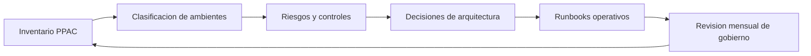

# Ruta Job-Ready Power Platform Admin / Governance

Esta ruta convierte el contenido actual de administración, seguridad, gobernanza y arquitectura de PlanEstudio en una preparación laboral específica para vacantes de **Power Platform Admin**, **Governance Specialist**, **CoE Lead** o **Platform Owner**.

No garantiza empleo. Tampoco convierte automáticamente los labs en experiencia laboral formal. Su valor está en ayudarte a practicar criterios de administración, reunir evidencia operativa y explicar decisiones de gobierno con el lenguaje que usan equipos de plataforma, seguridad y arquitectura.

## Criterio de profundidad de esta ruta

Esta ruta debe prepararte para dos niveles de conversación:

- **Admin/Governance operativo:** revisar ambientes, DLP, capacidad, licencias, owners, riesgos e
  incidentes desde Power Platform admin center.
- **Solution Architect con responsabilidad de gobierno:** justificar por qué una solución debe vivir
  en cierto ambiente, qué controles necesita antes de producción, qué excepciones acepta y qué
  deuda operativa queda documentada.

La evidencia mínima no es una captura del admin center. Es un paquete defendible: inventario,
matriz de ambientes, política DLP, análisis de licencias/capacidad, decisión de Managed
Environments, runbook de incidentes, modelo operativo CoE y resumen ejecutivo de riesgos.

## Vacantes objetivo

Esta ruta apunta a roles como:

- Power Platform Administrator.
- Power Platform Governance Specialist.
- Power Platform CoE Lead / CoE Analyst.
- Microsoft Business Applications Platform Owner.
- Power Platform Solution Architect con responsabilidad de gobierno.
- Administrador de ambientes Power Apps / Power Automate / Dataverse.

## Resultado esperado

Al completar la secuencia recomendada, deberías poder explicar y demostrar:

- Cómo evaluar un tenant o conjunto de ambientes desde Power Platform admin center.
- Cómo diseñar una estrategia de ambientes DEV/TEST/PROD, sandbox, personal productivity y producción.
- Cómo aplicar DLP policies, security roles y principio de mínimo privilegio.
- Cómo razonar sobre licensing, capacity, Managed Environments y recomendaciones operativas.
- Cómo usar auditoría, logs y Microsoft Purview como parte de una investigación.
- Cómo presentar un modelo de CoE moderno basado en personas, procesos, políticas y mejora continua.
- Cómo convertir hallazgos de administración en decisiones arquitectónicas: restricciones,
  trade-offs, excepciones, owners, presupuesto y riesgo aceptado.

## Enfoque moderno de gobierno

El gobierno moderno de Power Platform no debe depender únicamente de instalar el CoE Starter Kit. Microsoft ha movido capacidades clave de inventario, uso, monitoreo y acciones hacia experiencias nativas del Power Platform admin center. El CoE Starter Kit puede servir como referencia o acelerador histórico, pero la ruta laboral debe priorizar:

- **PPAC como superficie principal:** ambientes, recursos, inventario, analytics, monitor, capacity, licensing y acciones.
- **Managed Environments:** controles premium para administrar a escala con más visibilidad y restricciones.
- **DLP y seguridad:** políticas por ambiente, separación de conectores, roles y mínimo privilegio.
- **Auditoría y Purview:** trazabilidad para investigar actividad, cambios y riesgos.
- **CoE operativo:** gobierno como capacidad organizacional, no como instalación de una solución.

## Modelo operativo recomendado

Un administrador junior tiende a listar configuraciones. Un perfil job-ready debe convertirlas en
operación repetible:

| Cadencia | Actividad | Evidencia |
|---|---|---|
| Diaria | Revisar incidentes críticos: flujos fallidos, apps bloqueadas, alertas de seguridad | Registro de incidente y acción tomada |
| Semanal | Revisar apps/flujos de alto uso, owners faltantes, conectores riesgosos | Reporte operativo para plataforma |
| Mensual | Revisar DLP, capacidad, licencias, ambientes sin uso y excepciones vencidas | Comité de gobierno con decisiones |
| Trimestral | Revaluar Managed Environments, políticas de ambiente, auditoría y roadmap CoE | Resumen ejecutivo y backlog de remediación |

## Puente hacia Solution Architect

Para roles de arquitectura, no basta con saber dónde se configura cada control. Debes explicar qué
decisión protege y qué costo introduce.

| Decisión arquitectónica | Pregunta que debes responder | Evidencia |
|---|---|---|
| Separar DEV/TEST/PROD | ¿Qué riesgo evita y qué proceso de ALM exige? | Matriz de ambientes y política de promoción |
| Habilitar Managed Environments | ¿Qué controles justifican el costo/licenciamiento? | ADR con capacidades habilitadas y presupuesto |
| Restringir Default environment | ¿Qué se puede controlar si no se puede eliminar? | Plan de contención, comunicación y migración progresiva |
| Crear excepción DLP | ¿Qué riesgo se acepta, por cuánto tiempo y quién aprueba? | Registro de excepción con fecha de expiración |
| Usar CoE Starter Kit | ¿Qué problema resuelve que PPAC nativo no cubre suficientemente? | Decision record: PPAC nativo vs CoE Starter Kit |
| Investigar actividad sospechosa | ¿Qué fuente responde cada pregunta: Dataverse audit, Purview o PPAC? | Runbook de investigación y matriz de fuentes |

## Alineación técnica actual

Mantén estas ideas como base cuando expliques gobierno moderno:

- Power Platform admin center es la superficie central para administrar ambientes y configuración
  de plataforma.
- Las data policies/DLP funcionan como guardrails: clasifican conectores y reducen el riesgo de
  exposición accidental de datos; no sustituyen diseño de seguridad de Dataverse.
- Managed Environments agrupa capacidades premium para administrar a escala con más control e
  insights; requiere revisar licenciamiento antes de recomendarlo.
- Los logs de actividad de Power Platform se consultan en Microsoft Purview con permisos y
  licenciamiento adecuados; Dataverse auditing se configura por ambiente/tabla y consume log
  storage.
- El CoE Starter Kit puede seguir siendo útil para inventario, procesos y nurture, pero no debe
  presentarse como la única forma de gobernar Power Platform.

## Skills laborales y estado actual

| Skill laboral | Estado actual | Contenido actual | Evidencia posible hoy | Brecha |
|---|---|---|---|---|
| Power Platform admin center | Cubierto | Módulos 1, 31, 32; LAB-076 | Inventario, DLP, capacidad y decisiones de gobierno documentadas en JR-006 | Profundizar export real de inventario cuando haya tenant |
| Environment strategy | Cubierto | Módulos 31, 33; LAB-056, LAB-076 | Diagrama DEV/TEST/PROD y política de promoción | Agregar criterios por tipo de workload |
| Environment types y lifecycle | Parcial | Módulos 31, 33 | Matriz de ambientes | Falta runbook de creación/cierre |
| DLP policies | Cubierto | Módulos 31, 33, 36; LAB-032, LAB-076 | Política DLP, prueba de bloqueo y decisión de excepción | Conectar a revisión periódica con fecha de expiración |
| Security roles | Cubierto | Módulos 9, 16, 36; LAB-009 | Matriz rol-entidad-privilegio | Profundizar troubleshooting de acceso |
| Managed Environments | Parcial | Módulo 33, LAB-056, LAB-076 | Decisión de habilitación con impacto de licenciamiento | Falta práctica real de activar/configurar controles |
| Licensing | Parcial | Módulos 31, 40; LAB-076 | Análisis por escenario y licencias sin uso | Falta conexión con datos reales de consumo |
| Capacity planning | Parcial | Módulos 31, 35; LAB-076 | Estimación de capacidad y riesgos | Falta monitoreo continuo con datos reales |
| Dataverse auditing | Parcial | Módulo 36; LAB-076 conceptual | Diseño de auditoría e hipótesis de investigación | Falta consulta real de logs |
| Purview / activity logs | Awareness | Módulo 36 | Awareness de auditoría centralizada | Falta simulación de investigación |
| Inventory / usage / monitor / actions | Parcial | Módulo 32; LAB-076 | Reporte conceptual de CoE y priorización PPAC | Falta export real de inventario |
| CoE operativo | Cubierto a nivel de diseño | Módulos 31, 32; LAB-032, LAB-076 | Modelo de gobierno y operación recurrente | Falta simulación completa de comité mensual |
| Soporte operativo | Parcial | Módulos 26, 31, 32; LAB-076 | Runbook para flujo, app, export sospechosa y ambiente sin dueño | Falta incidente app/flow con logs reales |
| Reporte ejecutivo de riesgos | Cubierto | Módulos 31, 38, 40; LAB-076 | Recomendaciones priorizadas y roadmap | Mantener formato ejecutivo, no solo tabla técnica |
| Architecture Decision Records de gobierno | Parcial | Módulos 18, 31, 33; LAB-070, LAB-090 como complemento | ADRs de ambiente, DLP, Managed Environments y excepción | Falta plantilla específica en lab dedicado |

## Secuencia recomendada de estudio

1. **Gobierno enterprise:** Módulo 31 para conceptos de landing zone, DLP, ownership, riesgos y modelo de gobierno.
2. **CoE y administración a escala:** Módulo 32 y LAB-032, leyéndolos con enfoque moderno: CoE como práctica operativa y PPAC como fuente principal.
3. **Estrategia de ambientes:** Módulo 33 y LAB-056 para DEV/TEST/PROD, Managed Environments, multi-tenant y restricciones.
4. **Seguridad y cumplimiento:** Módulo 36 para Zero Trust, auditoría, Purview, DLP y defensa en profundidad.
5. **Decisión arquitectónica:** Módulo 40 para casos tipo Solution Architect sobre licenciamiento, riesgo, migración y gobierno; PL-600 queda solo como referencia histórica retirada.
6. **Job-ready assessment:** LAB-076 para convertir inventario, DLP, licencias, capacidad y runbook
   en evidencia laboral.
7. **Puente Solution Architect:** usar LAB-090 si tu vacante exige propuesta enterprise y decision
   log; no reemplaza el assessment Admin, lo complementa.

## Mapeo a contenido actual

| Contenido | Uso dentro de esta ruta | Qué debes extraer como evidencia |
|---|---|---|
| Módulo 31 - Enterprise Architecture y Gobernanza | Marco de gobierno | Modelo de gobierno, riesgos, DLP y ownership |
| Módulo 32 - CoE Starter Kit y Administración a Escala | CoE y visibilidad | Inventario, operación de CoE y transición hacia PPAC nativo |
| Módulo 33 - Multi-tenant, Multi-geo y Estrategia de Ambientes | Estrategia de ambientes | Matriz de ambientes, Managed Environments, restricciones por región |
| Módulo 36 - Seguridad y Cumplimiento Enterprise | Seguridad y auditoría | Diseño de auditoría, DLP, Purview y controles de datos |
| Módulo 40 - Arquitectura Power Platform | Decisión de arquitectura | Respuestas de escenario sobre gobierno, licencias y riesgo |
| LAB-032 | Gobernanza a escala | Reporte CoE/gobierno y recomendaciones |
| LAB-056 | Cambio de ambientes DEV/TEST/PROD | Evidencia de promoción controlada y estrategia de ambientes |
| LAB-076 (JR-006) | Assessment PPAC job-ready | Informe de tenant, DLP, capacidad, licencias, Managed Environments y runbooks |
| LAB-090 | Capstone enterprise D365 | Decision log y propuesta ejecutiva cuando la vacante cruza gobierno con arquitectura D365 |

## Evidencia de portafolio

Un portafolio Admin/Governance debería incluir al menos:

- Governance assessment de 3-5 páginas para un tenant ficticio o de práctica.
- Matriz de ambientes: propósito, tipo, owners, DLP, datos, usuarios y ciclo de vida.
- Política DLP documentada con conectores Business, Non-business y Blocked.
- Matriz de roles de seguridad y justificación de mínimo privilegio.
- Análisis de Managed Environments: cuándo habilitar, impacto, licenciamiento y controles esperados.
- Análisis de capacity/licensing con riesgos y recomendaciones.
- Runbook operativo: qué revisar ante app crítica caída, flujo fallando o capacity alert.
- Diseño de auditoría: qué eventos investigar, dónde mirar y cuándo escalar a seguridad/Purview.
- Resumen ejecutivo de riesgos con prioridades Alta/Media/Baja.
- Decision log con al menos 5 ADRs: ambiente, DLP, Managed Environments, Default environment y
  auditoría/Purview.

## Plantillas mínimas de entrega

### 1. Governance assessment

| Sección | Qué debe contener |
|---|---|
| Resumen ejecutivo | 3-5 riesgos principales, impacto, decisión recomendada |
| Inventario | Ambientes, owners, tipo, criticidad, apps/flujos activos, conectores relevantes |
| Riesgos | Score por probabilidad/impacto y dueño de mitigación |
| Controles | DLP, security roles, Managed Environments, auditoría, ALM |
| Roadmap | Quick wins 0-30 días, estabilización 30-60, gobierno recurrente 60-90 |

### 2. Matriz de ambientes

| Ambiente | Tipo | Propósito | Owner | Datos | DLP | Managed | Ciclo de vida |
|---|---|---|---|---|---|---|---|
| Default | Default | Productividad personal controlada | Platform owner | Bajo/medio | Base restrictiva | No/según política | Contener y migrar apps críticas |
| DEV-CRM | Developer/Sandbox | Desarrollo solución CRM | Equipo CRM | Datos sintéticos | Dev | No | Revisión mensual |
| TEST-CRM | Sandbox | QA/UAT | QA + negocio | Datos anonimizados | Production-like | Opcional | Reset controlado |
| PROD-CRM | Production | Operación crítica | Owner negocio + TI | Datos reales | Strict | Sí si aplica | Backup, monitoreo y change control |

### 3. Registro de excepciones DLP

| Excepción | Justificación | Riesgo | Mitigación | Aprobador | Expira |
|---|---|---|---|---|---|
| Permitir conector X en ambiente Y | Proceso crítico temporal | Exfiltración de datos | Scope limitado + monitoreo | CISO/CTO | 90 días |

### 4. Runbook de incidente

| Incidente | Primeras preguntas | Fuente de evidencia | Acción inicial | Escalamiento |
|---|---|---|---|---|
| Flujo fallando en producción | ¿Desde cuándo? ¿Qué cambió? ¿Impacto usuario? | Run history, owner, solución | Pausar/reintentar/controlar cola | App owner + soporte |
| App con permisos excesivos | ¿Quién accede? ¿Qué tabla? ¿Qué rol? | Security roles, sharing, audit | Retirar acceso no aprobado | Seguridad + owner |
| Exportación sospechosa | ¿Quién exportó? ¿Qué datos? ¿Desde dónde? | Purview/activity logs, Dataverse audit | Preservar evidencia | Seguridad/Compliance |
| Ambiente sin dueño | ¿Qué apps son críticas? ¿Quién las usa? | PPAC inventory, usage | Asignar owner temporal | Comité de gobierno |

## Preguntas de entrevista

### PPAC y ambientes

- ¿Qué revisarías primero en Power Platform admin center ante un tenant desordenado?
- ¿Cómo decides cuántos ambientes necesita una organización?
- ¿Qué debería ir en Default environment y qué no?
- ¿Cómo separarías DEV, TEST y PROD para una solución crítica?
- ¿Qué controles aplicarías antes de permitir despliegues a producción?

### DLP, seguridad y acceso

- ¿Cómo diseñarías una DLP policy para bloquear conectores personales en producción?
- ¿Cómo manejarías una excepción temporal a una política DLP?
- ¿Cómo diagnosticarías que un usuario ve registros que no debería?
- ¿Cómo aplicarías mínimo privilegio en Dataverse?
- ¿Qué diferencia hay entre security roles, business units y field security?

### Licensing, capacity y Managed Environments

- ¿Cómo explicarías standard vs premium licensing a un stakeholder no técnico?
- ¿Qué revisarías si Dataverse está cerca del límite de storage?
- ¿Cuándo justificarías Managed Environments?
- ¿Qué riesgos trae habilitar Managed Environments sin revisar licencias?
- ¿Cómo presentarías una recomendación de reducción de costos sin romper cumplimiento?

### Auditoría, Purview y soporte operativo

- ¿Cómo investigarías quién modificó o exportó datos sensibles?
- ¿Qué diferencia hay entre auditoría Dataverse y actividad centralizada en Purview?
- ¿Qué debe contener un runbook de incidente para Power Platform?
- ¿Qué harías si un flujo crítico falla cada hora?
- ¿Cómo comunicarías un incidente de plataforma a negocio y seguridad?

### CoE moderno

- ¿Qué diferencia hay entre instalar CoE Starter Kit y operar un CoE?
- ¿Qué roles mínimos necesita un CoE efectivo?
- ¿Cómo equilibras innovación ciudadana y control central?
- ¿Qué métricas usarías para medir salud de la plataforma?
- ¿Cómo harías onboarding y offboarding de makers?

## Labs y capstones recomendados

| Lab disponible | Vacante que valida | Skills que valida | Evidencia esperada | Dificultad | Duración | Relación con portafolio |
|---|---|---|---|---|---|---|
| LAB-076 (JR-006) - PPAC Governance Assessment | Power Platform Admin / Governance Specialist | PPAC, DLP, ambientes, capacidad, licensing, operación | Informe de tenant, matriz de ambientes, DLP, runbook y riesgos | Avanzada | 4 h | Demuestra gobierno operativo y criterio de plataforma |
| LAB-032 - CoE Starter Kit | CoE Lead / Governance Analyst | Inventario, gobierno, nurture, compliance conceptual | Reporte CoE/gobierno y decisiones | Avanzada | 3-4 h | Complementa LAB-076 cuando la vacante menciona CoE |
| LAB-056 - Ambientes DEV/TEST/PROD | Admin / ALM / Architect | Separación de ambientes, promoción, control de cambios | Evidencia de estrategia de ambientes | Intermedia | 2 h | Apoya el apartado de environment strategy |
| LAB-090 - Capstone Enterprise D365 | Solution Architect | Arquitectura enterprise, decision log, roadmap, ownership | Propuesta ejecutiva y decision log | Avanzada | 4 h | Complemento si la vacante cruza gobierno con arquitectura D365 |

## Brechas críticas

1. LAB-076 cubre assessment operativo, pero falta una simulación más profunda de investigación con
   logs reales en Microsoft Purview y Dataverse audit.
2. Managed Environments está tratado como decisión; falta práctica real activando controles
   específicos como sharing limits, environment groups, IP firewall o pipelines nativos.
3. CoE Starter Kit existe en contenido, pero la ruta debe seguir reforzando PPAC nativo y CoE
   operativo moderno sobre la instalación del kit.
4. Falta un incidente app/flow con evidencia real de run history, owner, cambio reciente y plan de
   remediación.
5. Solution Architect queda bien como puente de decisión, pero no existe una ruta job-ready separada
   solo de arquitectura Power Platform enterprise; hoy se cubre mediante Módulos 31-41, LAB-090 y
   capstones.

## Checklist antes de aplicar

- [ ] Puedo explicar qué revisar en PPAC durante los primeros 30 minutos de un assessment.
- [ ] Tengo una matriz de ambientes DEV/TEST/PROD con owners, DLP y propósito.
- [ ] Puedo diseñar una DLP policy y defender sus excepciones.
- [ ] Puedo explicar cuándo usar Managed Environments y qué impacto tiene en licenciamiento.
- [ ] Puedo estimar riesgos de capacity y proponer remediación.
- [ ] Puedo explicar cómo investigaría actividad sospechosa usando auditoría/Purview.
- [ ] Tengo un runbook operativo para incidentes de apps/flujos.
- [ ] Puedo explicar CoE como operación continua, no solo como instalación de un kit.
- [ ] Puedo presentar riesgos y recomendaciones a un stakeholder no técnico.

## Relación con recursos existentes

- Usa la [Matriz de Skills Laborales](MATRIZ_SKILLS_LABORALES.md) para ver cómo esta ruta encaja con otras vacantes.
- Usa la [Matriz de Competencias](MATRIZ_COMPETENCIAS.md) para criterios de evidencia demostrable.
- Usa [Cómo Convertir tus Labs en Portafolio Profesional](PORTAFOLIO_PROFESIONAL.md) para empaquetar assessment, runbooks, capturas y decisiones.

