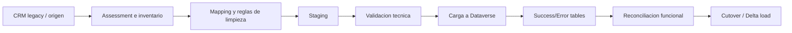

# Ruta Job-Ready Data Migration + CRM Legacy

Esta ruta convierte el contenido actual de migracion, arquitectura e integraciones en una preparacion laboral especifica para vacantes de **CRM Migration Specialist**, **Dynamics 365 Migration Consultant**, **Legacy Modernization Consultant** o **Solution Architect junior-mid**.

No garantiza empleo. Tampoco convierte automaticamente los labs en experiencia laboral formal. Su valor esta en ayudarte a practicar decisiones, documentar artefactos de migracion y explicar riesgos con lenguaje de proyecto real.

## Criterio de profundidad de esta ruta

Esta ruta no busca que memorices herramientas aisladas. Busca que puedas defender un proceso de
migracion ante tres audiencias distintas:

- **Negocio:** que datos se migran, que datos se archivan, que riesgos quedan y que significa
  go/no-go.
- **TI/arquitectura:** como se carga, como se reintenta, como se protege la integridad referencial
  y como se reduce dependencia del sistema legacy.
- **Entrevista laboral:** que artefactos puedes mostrar sin decir que administraste un CRM
  on-premises real si solo trabajaste sobre un caso simulado.

La evidencia minima aceptable no es una lista de conceptos; es un paquete de artefactos conectados:
assessment, mapping, reglas de limpieza, diseno de staging, estrategia de carga, reconciliacion,
runbook de cutover y health assessment legacy.

## Vacantes objetivo

Esta ruta apunta a roles como:

- Dynamics 365 Migration Consultant.
- CRM Migration Specialist.
- Legacy Modernization Consultant.
- Data Migration Analyst para Dataverse.
- Functional-Technical Consultant con foco en migracion y soporte de cutover.
- Solution Architect junior-mid en proyectos de modernizacion CRM.

## Resultado esperado

Al completar esta ruta, deberias poder explicar y demostrar:

- Como evaluar un CRM legacy antes de migrarlo a Dynamics 365.
- Como construir un mapping origen-destino hacia Dataverse.
- Como definir reglas de limpieza, deduplicacion y descarte.
- Como usar staging, success/error tables y flags de procesamiento para controlar una migracion compleja.
- Como elegir entre import wizard, dataflows, Azure Data Factory, bulk APIs, Upsert o herramientas especializadas segun volumen y complejidad.
- Como validar datos despues de cargar: conteos, muestras, integridad referencial y reconciliacion funcional.
- Como preparar un plan de cutover, delta load, rollback y comunicacion a usuarios.
- Que revisar conceptualmente en CRM on-premises: SQL Server, IIS, red, versiones, customizaciones, jobs e integraciones.
- Como explicar limites de una simulacion: que parte ejecutaste, que parte disenaste y que parte
  requeriria acceso real a servidores, tenant o datos productivos.

## Enfoque moderno de migracion

Una migracion laboral no debe tratarse como "subir un Excel". El enfoque recomendado es:

- **Clasificar complejidad:** distinguir migraciones simples, medias y complejas por volumen, relaciones, customizaciones y criticidad del negocio.
- **Separar assessment de ejecucion:** primero inventario, calidad de datos, dependencias, integraciones y riesgos; despues carga.
- **Usar staging para escenarios complejos:** una base intermedia permite transformar, auditar, reintentar y validar sin golpear directamente el sistema origen o Dataverse.
- **Disenar cargas repetibles:** usar claves externas, `Upsert`, success/error tables y estados de procesamiento para reanudar sin duplicar datos.
- **Cargar por secuencia:** migrar tablas de menor dependencia primero, resolver lookups y manejar ciclos con inserciones parciales y actualizaciones posteriores.
- **Optimizar sin ignorar limites:** ajustar batch size, concurrencia, reintentos y manejo de throttling; no sacrificar integridad por velocidad.
- **Validar con negocio:** los conteos tecnicos no bastan; usuarios clave deben confirmar que los datos sirven para operar.
- **Planear cutover:** definir ventana, delta load, congelamiento, comunicacion, rollback y criterios de go/no-go.

## Patron de migracion compleja

Para entrevistas y escenarios reales, describe una migracion compleja como un flujo controlado, no
como una carga directa:

| Etapa | Decision clave | Evidencia laboral |
|---|---|---|
| Assessment | Migracion simple, media o compleja | Inventario de tablas, volumenes, integraciones y riesgos |
| Mapping | Crear, actualizar, fusionar, archivar o descartar | Workbook origen-destino con owner funcional |
| Cleansing | Regla deterministica vs revision manual | Catalogo de reglas y excepciones |
| Staging | Carga directa vs base intermedia | Diseno con `source_id`, `batch_id`, estado y error |
| Load | Dataflow, ADF, API, bulk operation o herramienta especializada | Decision record por volumen y complejidad |
| Reconciliation | Conteos tecnicos vs aceptacion funcional | Reporte con muestras aprobadas por negocio |
| Cutover | Big bang, por fases o paralelo temporal | Runbook con freeze, delta, rollback y comunicacion |

## Alineacion tecnica actual

Usa estas reglas para mantener el discurso alineado con practicas modernas de Dataverse y Dynamics
365:

- **Migracion simple:** puede resolverse con importacion guiada, dataflows o cargas controladas si
  el volumen, las relaciones y las transformaciones son bajas.
- **Migracion media:** requiere mapping formal, reglas de limpieza, ejecuciones repetibles y
  reconciliacion por tabla.
- **Migracion compleja:** requiere staging, secuencia por dependencias, manejo de lookups,
  success/error tables, reintentos y validacion funcional segmentada.
- **Operaciones masivas:** para escenarios de alto volumen, evalua APIs/mensajes de Dataverse como
  `CreateMultiple`, `UpdateMultiple` y `UpsertMultiple`, junto con batch size, concurrencia,
  reintentos y limites de proteccion del servicio.
- **Idempotencia:** usa claves externas/alternate keys y `Upsert` cuando la carga pueda repetirse.
  La pregunta de entrevista no es solo "como cargo", sino "como repito la carga sin duplicar".
- **CRM on-premises:** trata la migracion a cloud como un proceso formal: versiones soportadas,
  SQL Server, customizaciones no soportadas, integraciones directas a SQL, servicios async,
  certificados, autenticacion e inventario de dependencias.

## Skills laborales y estado actual

| Skill laboral | Estado en PlanEstudio | Evidencia esperada | Pregunta tipica de entrevista |
|---|---|---|---|
| Source system assessment | Cubierto por ruta + LAB-075/LAB-078 | Inventario de tablas, volumenes, integraciones y riesgos | ¿Que preguntas haces antes de migrar un CRM legacy? |
| Mapping origen-destino | Cubierto por LAB-075 | Workbook con tabla origen, campo destino, regla y responsable | ¿Que haces con campos legacy sin equivalente en Dataverse? |
| Data cleansing | Cubierto por LAB-075 | Reglas de deduplicacion, normalizacion y descarte aplicadas a muestra | ¿Como limpias datos antes de cargarlos a Dataverse? |
| Staging database | Cubierto por LAB-075 | Modelo conceptual con tablas main, success y error | ¿Por que usar staging en una migracion compleja? |
| Importacion batch | Parcial | Estrategia de carga por lotes y manejo de errores | ¿Por que Excel no es suficiente para millones de registros? |
| Upsert / claves externas | Parcial | Estrategia idempotente para cargas repetibles | ¿Como evitas duplicados si repites una carga? |
| Bulk operations | Awareness fuerte | Decision document sobre APIs, batch size y retries | ¿Como manejas throttling o errores 429? |
| Reconciliacion | Cubierto por LAB-075 | Reporte con conteos, muestras y reglas de integridad | ¿Como demuestras que la migracion fue correcta? |
| Cutover | Cubierto por LAB-075 | Runbook con ventana, delta, rollback y comunicacion | ¿Que contiene un plan de cutover CRM? |
| SQL/IIS/networking awareness | Cubierto por LAB-078 | Checklist conceptual de salud on-prem | ¿Que revisas si CRM on-prem esta lento? |
| Health assessment | Cubierto por LAB-078 | Informe de riesgos y roadmap de migracion | ¿Que pondrias en un health assessment de CRM? |

## Secuencia recomendada

1. **Refrescar Dataverse y seguridad:** repasar modelado, relaciones, ownership y roles antes de hablar de migracion.
2. **Estudiar integraciones empresariales:** entender APIs, conectividad, gateways, Service Bus, APIM y patrones sync/async.
3. **Revisar rendimiento y escalabilidad:** conectar migracion con limites, volumenes, jobs, batch y monitoreo.
4. **Estudiar estrategias de migracion empresarial:** Strangler Fig, paralelo temporal, fases, cutover y retiro legacy.
5. **Construir artefactos JR-5:** mapping, reglas de limpieza, staging conceptual, reconciliacion y cutover.
6. **Agregar awareness CRM on-prem:** SQL Server, IIS, networking, versiones, customizaciones e integraciones.
7. **Preparar entrevista:** explicar trade-offs: simple vs compleja, import wizard vs ADF, create/update vs Upsert, big bang vs phased migration.
8. **Cerrar con labs job-ready:** ejecutar LAB-075 para migracion de datos y LAB-078 para health
   assessment legacy. Si no tienes tenant ni servidor real, deja claro que la evidencia es
   simulada/documental y no operativa.

## Mapeo a contenido actual

| Contenido actual | Como usarlo para JR-5 | Evidencia sugerida |
|---|---|---|
| Modulo 34 - Integraciones empresariales | Base para sistemas origen, APIs, conectividad y patrones de integracion | Diagrama de flujo origen -> staging -> Dataverse |
| Modulo 35 - Rendimiento y escalabilidad | Base para batch, limites, performance y monitoreo | Decision record de rendimiento y retries |
| Modulo 37 - Estrategias de migracion empresarial | Base principal para roadmap, paralelo temporal y cutover | Plan de migracion por fases |
| Modulo 39 - Casos de transformacion digital | Contexto de modernizacion legacy y negocio | Caso ejecutivo con riesgos y beneficios |
| Modulo 40 - Licenciamiento y roadmap | Estimacion, costos, licencias y capacidad | Supuestos de licenciamiento/capacidad |
| Modulos 53/54 | Integracion, ALM y despliegue si la migracion requiere componentes tecnicos | Checklist ALM y despliegue |
| LAB-064 conceptual | Punto de partida para documentar migracion | Mapping y reporte de validacion |
| Rutas Developer/Admin/Functional | Complemento para seguridad, automatizacion, soporte y arquitectura | Evidencias transversales |

## Evidencia de portafolio

Un portafolio JR-5 convincente deberia incluir:

1. **Migration assessment brief**
   - Sistema origen, modulos, volumenes, tablas principales, integraciones, usuarios y riesgos.
   - Decision: migracion simple, media o compleja.

2. **Mapping workbook**
   - Tabla origen.
   - Campo origen.
   - Tabla Dataverse destino.
   - Campo destino.
   - Tipo de transformacion.
   - Regla de limpieza.
   - Responsable funcional.
   - Estado: aprobado, pendiente, descartado.

3. **Data cleansing rules**
   - Deduplicacion de cuentas/contactos.
   - Normalizacion de telefono, correo, pais, ciudad y estados.
   - Campos obligatorios.
   - Campos legacy que se archivan o descartan.

4. **Staging design**
   - Main staging table.
   - Success table.
   - Error table.
   - Processing flag.
   - External ID.
   - Batch ID.
   - Fecha de carga.

5. **Load strategy**
   - Herramienta propuesta.
   - Orden de tablas.
   - Manejo de lookups.
   - Uso de `Upsert`.
   - Reintentos.
   - Manejo de errores.

6. **Reconciliation report**
   - Conteo origen vs destino.
   - Conteo por tabla.
   - Muestras validadas por negocio.
   - Errores pendientes.
   - Reglas de aceptacion.

7. **Cutover runbook**
   - Ventana de corte.
   - Freeze de datos.
   - Delta load.
   - Validacion final.
   - Rollback.
   - Comunicacion a usuarios.

8. **Legacy health assessment**
   - Riesgos SQL/IIS/networking.
   - Customizaciones criticas.
   - Integraciones activas.
   - Jobs/procesos batch.
   - Recomendaciones antes de migrar.

## Plantillas minimas de entrega

### 1. Assessment brief

| Campo | Ejemplo esperado |
|---|---|
| Sistema origen | CRM legacy, version, hosting, owner tecnico |
| Volumen | Registros por tabla, tamano de base, adjuntos, historico |
| Criticidad | Procesos que dependen del sistema |
| Integraciones | Origen/destino, frecuencia, metodo, owner |
| Riesgos | Calidad de datos, customizaciones, performance, seguridad |
| Decision inicial | Simple, media o compleja, con razon |

### 2. Mapping workbook

| Tabla origen | Campo origen | Tabla destino | Campo destino | Transformacion | Regla de limpieza | Owner | Estado |
|---|---|---|---|---|---|---|---|
| account_legacy | customer_name | Account | name | Trim + proper case | Obligatorio, no `N/A` | Ventas | Aprobado |
| account_legacy | legacy_id | Account | new_externalid | Copia directa | Unico por origen | TI | Aprobado |
| contact_legacy | email | Contact | emailaddress1 | Lowercase | Validar formato | Servicio | Pendiente |

### 3. Staging y control de errores

| Tabla | Proposito | Campos minimos |
|---|---|---|
| `stg_account_main` | Entrada normalizada lista para cargar | `source_id`, `batch_id`, campos limpios, `processing_status` |
| `stg_account_success` | Registros cargados correctamente | `source_id`, `dataverse_id`, `loaded_at`, `batch_id` |
| `stg_account_error` | Registros rechazados o fallidos | `source_id`, `error_code`, `error_message`, `retry_count` |

### 4. Reconciliation report

| Validacion | Ejemplo |
|---|---|
| Conteo origen vs staging | 40.000 cuentas origen; 39.200 aceptadas; 800 rechazadas por regla |
| Conteo staging vs Dataverse | 39.200 enviadas; 39.160 cargadas; 40 con error tecnico |
| Integridad referencial | Contactos sin Account: 0 criticos, 18 en revision |
| Muestra funcional | 30 cuentas revisadas por usuario clave; 28 aprobadas, 2 corregidas |
| Decision | Go, go condicional o no-go |

### 5. Cutover runbook

| Momento | Actividad | Owner | Criterio de salida |
|---|---|---|---|
| T-5 dias | Confirmar freeze y comunicacion | PM | Usuarios notificados |
| T-2 dias | Ejecutar carga full final en staging | Data lead | Errores criticos = 0 |
| T-0 | Delta load | Migration lead | Delta conciliado |
| T+1 | Validacion funcional | Key users | Go/no-go firmado |
| Rollback | Reactivar legacy o revertir lote | Arquitectura/TI | Usuarios informados y datos consistentes |

## Preguntas de entrevista

### Migracion de datos

- ¿Como decides si una migracion es simple, media o compleja?
- ¿Por que una migracion compleja necesita staging?
- ¿Que informacion pides al cliente antes de estimar una migracion?
- ¿Como manejas campos legacy sin equivalente en Dataverse?
- ¿Como decides que datos historicos migrar y cuales archivar?

### Dataverse y carga

- ¿Cuando usarias import wizard, dataflows, Azure Data Factory o una integracion custom?
- ¿Como usarias `Upsert` para evitar duplicados?
- ¿Como manejas lookups durante una migracion?
- ¿Por que no conviene cerrar casos, oportunidades o leads antes de terminar la validacion?
- ¿Que haces si una carga falla a mitad del proceso?

### Validacion y reconciliacion

- ¿Como demuestras que los datos migrados son correctos?
- ¿Que validaciones tecnicas y funcionales haces?
- ¿Como documentas registros rechazados?
- ¿Que aceptarias como criterio de go/no-go?

### Cutover

- ¿Que contiene un runbook de cutover?
- ¿Cuando prefieres migracion por fases frente a big bang?
- ¿Como reduces downtime?
- ¿Como preparas rollback?

### CRM legacy / on-prem awareness

- ¿Que rol cumple IIS en Dynamics CRM on-premises?
- ¿Que revisarias en SQL Server si CRM esta lento?
- ¿Como identificas integraciones criticas antes de migrar?
- ¿Que riesgos trae migrar customizaciones antiguas sin redisenarlas?
- ¿Como explicarias a negocio que no todo dato historico debe migrarse?

## Labs Job-Ready disponibles

| Lab disponible | Prioridad | Perfil | Skills | Evidencia |
|---|---|---|---|---|
| LAB-075 (JR-005) - Data Migration to Dynamics 365 | Alta | Migration Specialist | mapping, cleansing, staging, importacion, reconciliacion, cutover | Mapping workbook, staging design, reconciliation report, cutover runbook |
| LAB-078 (JR-008) - CRM Legacy Health Assessment | Media-Alta | Legacy / Migration / Architect | SQL, IIS, networking, upgrade path, performance, riesgos | Health assessment, matriz de riesgos, roadmap de mitigacion |

Usa LAB-075 como evidencia principal de migracion y LAB-078 como evidencia principal de legacy
assessment. Presentalos juntos cuando una vacante combine "data migration", "CRM legacy",
"modernization" y "cloud migration".

## Brechas criticas

- ~~Falta un dataset sucio para practicar limpieza y deduplicacion~~ — LAB-075 incluye una muestra
  pequena pero util para ejercitar reglas; sigue faltando un dataset grande reutilizable.
- ~~Falta un lab ejecutable de staging, success/error tables y retry~~ — LAB-075 cubre el diseno
  conceptual; sigue faltando ejecucion real contra Dataverse con volumen alto.
- ~~Falta una simulacion de reconciliacion post-carga~~ — LAB-075 incluye reporte de
  reconciliacion; sigue faltando validacion con datos reales de negocio.
- ~~Falta un caso guiado de cutover con rollback~~ — LAB-075 incluye runbook; sigue faltando una
  simulacion cronometrada de cutover con incidentes inesperados.
- ~~Falta una practica visual de health assessment on-premises~~ — LAB-078 cubre assessment
  conceptual; sigue faltando acceso a logs/metricas reales de SQL, IIS y CRM Async Service.

Brechas que siguen abiertas:

- Dataset sucio de mayor tamano (CSV/Excel) para limpieza, deduplicacion y reconciliacion mas realista.
- Ejercicio tecnico opcional con Dataflows, Azure Data Factory o Dataverse Web API contra un tenant
  real de practica.
- Simulacion de performance con bulk operations, service protection limits, retries y particion por lotes.
- Evidencia real de CRM on-premises: logs, SQL metrics, IIS, Async Service y customizaciones solo
  pueden practicarse plenamente con acceso a infraestructura real.

Estas brechas no bloquean el aprendizaje, pero si marcan que JR-5 debe presentarse como preparacion y criterio profesional, no como experiencia operativa completa.

## Checklist antes de aplicar

Antes de aplicar a una vacante de migracion o legacy CRM, deberias poder:

- [ ] Explicar la diferencia entre migracion simple, media y compleja.
- [ ] Crear un mapping origen-destino con reglas de transformacion.
- [ ] Identificar datos duplicados, incompletos o irrelevantes.
- [ ] Explicar por que staging reduce riesgo.
- [ ] Definir una estrategia de carga por lotes.
- [ ] Explicar `Upsert` y claves externas.
- [ ] Proponer manejo de errores y reintentos.
- [ ] Crear un reporte de reconciliacion.
- [ ] Escribir un runbook de cutover.
- [ ] Explicar riesgos de SQL/IIS/networking en CRM on-premises.
- [ ] Presentar un health assessment conceptual sin exagerar experiencia real.

## Relacion con recursos existentes

- **Matriz de Skills Laborales:** JR-5 profundiza la brecha "Data Migration & Legacy CRM".
- **Ruta CRM Functional:** ayuda a validar que los datos migrados soportan procesos reales de Sales/Customer Service.
- **Ruta CRM Developer:** complementa integraciones, Web API, plugins y ALM cuando la migracion requiere desarrollo.
- **Ruta Admin/Governance:** complementa capacidad, ambientes, DLP, licenciamiento y seguridad.
- **Portafolio profesional:** los artefactos JR-5 deben presentarse como proyecto academico/profesional simulado, con alcance claro y evidencias verificables.
